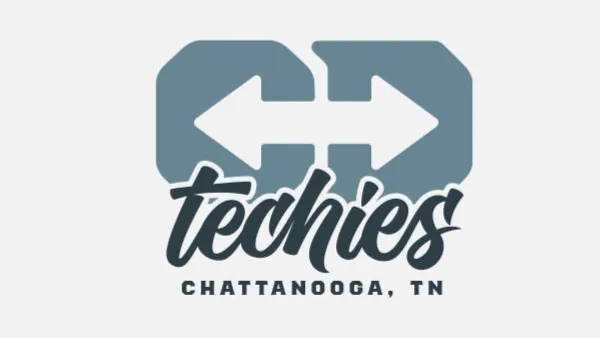

# CD Tech

Trying to get into Tech but don't know where to start? ChaDev, in collaboration with ChaTech, presents CD Tech just for you!

  

## Introduction

CD Tech is a group formed to help career changers and aspiring tech enthusiasts transition into the world of technology. If you've been struggling to find your way into the tech industry, join us to get the support, mentorship, and friendship you need to thrive.

## Join Us!

Everyone is welcome to join CD Tech, whether you're a complete beginner or have some tech experience. Don't hesitate to drop by and see what we're all about. Join us at our next Meetup and be a part of this exciting journey.

## Event Details

- **Date**: Every other Thursday
- **Location**: AlloHire ([Google Maps Link](https://www.google.com/maps/search/?api=1&query=35.039825%2C%20-85.308334))
- **Time**: 6:00 PM to 9:00 PM, EST

## What to Expect

At CD Tech, we aim to create an inclusive and welcoming environment for everyone interested in tech. Our meetups are designed to be interactive, informative, and fun! Here's what you can expect:

- **Website Project**: We are currently working remotely on building our own group website, emulating a professional workflow. Contribute and learn in a team-oriented project.
- **Networking**: Meet like-minded individuals and connect with others who are also starting their tech journey.
- **Group Discussions**: Engage in open discussions where we share and address the current challenges we face as we transition into tech careers.
- **Goal Setting**: Collaboratively set group and personal goals to keep ourselves motivated and accountable.
- **Q&A Corner with Seniors**: Get the chance to ask questions and seek guidance from experienced tech professionals during our Q&A sessions.
- **General Nerdery**: Embrace your passion for technology and explore various tech-related topics with fellow nerds.

## How to Contribute to the CD Tech Website Project
Want to gain hands-on experience working on programming projects with a team? Check out our [CONTRIBUTING.md](CONTRIBUTING.md) document for more info on how to get involved. 

This GitHub repository serves as the primary source for our website project. If you're new to GitHub, don't worry! We'll help you get started.

## Social Media Links
1. Join the CD Tech group through <a href="https://www.meetup.com/chadevs/" target="_blank">ChaDev on Meetup</a> and RSVP for our next event.
2. Follow <a href="https://www.linkedin.com/groups/14283167/" target="_blank">CD Tech on LinkedIn</a> to stay updated about the event schedule.
3. Follow <a href="https://www.linkedin.com/company/chatechcouncil/" target="_blank">ChaTech on LinkedIn</a> to receive updates about events happening in the Chattanooga tech community.

## Contact Us

Have any questions or need more information? Feel free to reach out to us on LinkedIn or via email at [thmscly@gmail.com](mailto:thmscly@gmail.com).

## Organizers

- <a href="https://www.linkedin.com/in/thomas-tc-cox/" target="_blank">T.C Cox</a>

## License

This project is licensed under the [Creative Commons Attribution-ShareAlike 4.0 International License](http://creativecommons.org/licenses/by-sa/4.0/).
